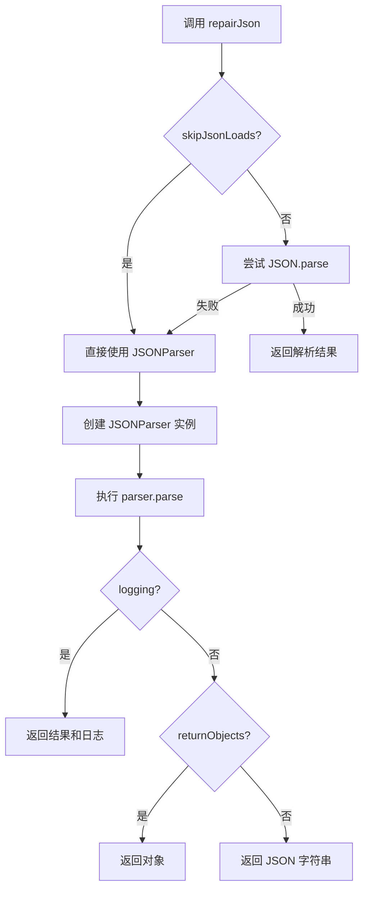
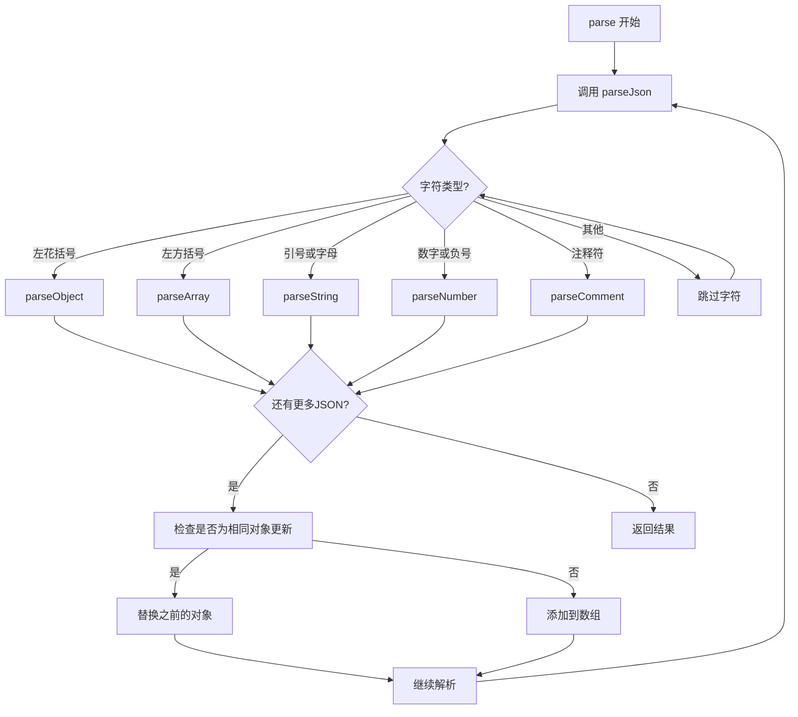
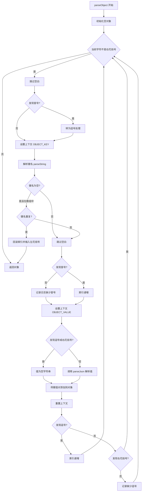
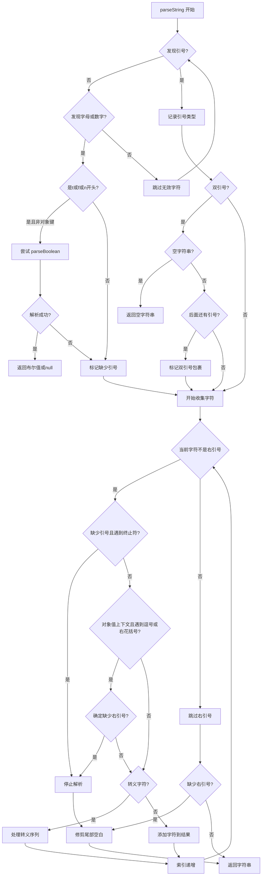
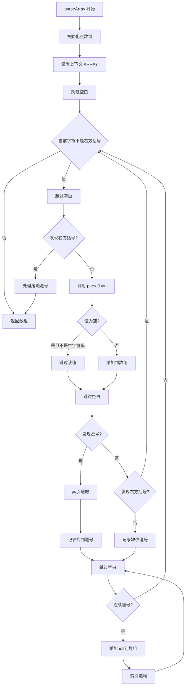

# JSON 修复方案详细说明

## 概述

本项目实现了一个智能的 JSON 修复解析器，能够处理各种格式不规范的 JSON 字符串，并将其转换为标准的 JSON 格式。该方案采用了容错性强的递归下降解析器架构。

## 核心设计理念

1. **优先尝试标准解析**：先使用原生 `JSON.parse()` 尝试解析，如果成功则直接返回
2. **容错解析**：当标准解析失败时，启用自定义解析器进行智能修复
3. **上下文感知**：通过上下文栈跟踪当前解析位置（对象键、对象值、数组）
4. **增量修复**：在解析过程中实时修复问题，而不是预处理整个字符串

## 整体架构

### 主要模块

```
┌─────────────────────────────────────────────────────────────┐
│                      jsonRepair.ts                           │
│  ┌───────────────────────────────────────────────────────┐  │
│  │  repairJson(jsonStr, options)                         │  │
│  │  - 入口函数，决定使用标准解析还是自定义解析            │  │
│  │  - 处理返回格式（对象/字符串/带日志）                  │  │
│  └───────────────────────────────────────────────────────┘  │
└─────────────────────────────────────────────────────────────┘
                            │
                            ▼
┌─────────────────────────────────────────────────────────────┐
│                      jsonParser.ts                           │
│  ┌───────────────────────────────────────────────────────┐  │
│  │  JSONParser                                           │  │
│  │  - 核心解析引擎                                        │  │
│  │  - 维护解析索引和上下文                               │  │
│  │  - 协调各个子解析器                                    │  │
│  └───────────────────────────────────────────────────────┘  │
└─────────────────────────────────────────────────────────────┘
            │                 │                 │
            ▼                 ▼                 ▼
┌──────────────┐  ┌──────────────┐  ┌──────────────┐
│ parseObject  │  │ parseArray   │  │ parseString  │
│ parseNumber  │  │ parseComment │  │ parseBoolean │
└──────────────┘  └──────────────┘  └──────────────┘
            │                 │                 │
            └─────────────────┴─────────────────┘
                            │
                            ▼
            ┌──────────────────────────────┐
            │    jsonContext.ts             │
            │  - 上下文栈管理               │
            │  - OBJECT_KEY                │
            │  - OBJECT_VALUE              │
            │  - ARRAY                     │
            └──────────────────────────────┘
```

## 核心流程

### 1. 主入口流程



### 2. JSONParser 解析流程



### 3. 对象解析流程（parseObject）



### 4. 字符串解析流程（parseString）



### 5. 数组解析流程（parseArray）



## 支持的修复类型

### 1. 对象键名问题

#### 缺少引号
```javascript
// 输入
{name: "value", age: 123}

// 输出
{"name": "value", "age": 123}
```

**修复策略**：在 `parseString` 中检测到字母数字开头且在 `OBJECT_KEY` 上下文时，标记 `missingQuotes=true`，遇到 `:` 或空白时停止收集。

#### 单引号
```javascript
// 输入
{'name': 'value'}

// 输出
{"name": "value"}
```

**修复策略**：`parseString` 识别单引号作为字符串分隔符，正常解析后由 `JSON.stringify` 转换为双引号。

### 2. 尾随逗号

#### 对象尾随逗号
```javascript
// 输入
{"name": "value", "age": 123,}

// 输出
{"name": "value", "age": 123}
```

**修复策略**：在 `parseObject` 的循环中，遇到 `,` 后检查下一个字符，如果是 `}`，则自动终止键值对解析。

#### 数组尾随逗号
```javascript
// 输入
[1, 2, 3,]

// 输出
[1, 2, 3]
```

**修复策略**：在 `parseArray` 中，解析逗号后检查下一个字符，如果是 `]`，则跳出循环。

### 3. 缺少逗号

#### 对象缺少逗号
```javascript
// 输入
{"name": "value" "age": 123}

// 输出
{"name": "value", "age": 123}
```

**修复策略**：在 `parseObject` 中，解析完一个键值对后，如果下一个字符不是 `,` 也不是 `}`，记录日志但继续解析下一个键。

#### 数组缺少逗号
```javascript
// 输入
[1 2 3]

// 输出
[1, 2, 3]
```

**修复策略**：在 `parseArray` 中，解析完一个元素后，如果下一个字符不是 `,` 也不是 `]`，记录日志但继续解析。

### 4. 缺少引号

#### 字符串缺少左引号
```javascript
// 输入
{"name": value"}

// 输出
{"name": "value"}
```

**修复策略**：在 `parseString` 中检测到字母开头但不是布尔值时，标记 `missingQuotes=true`，根据上下文（`:`、`,`、`}`、`]`）判断字符串结束。

#### 字符串缺少右引号
```javascript
// 输入
{"name": "value}

// 输出
{"name": "value"}
```

**修复策略**：在 `parseString` 中，当处于 `OBJECT_VALUE` 上下文且遇到 `,` 或 `}` 时，检查是否缺少右引号，如果确认缺少则停止收集。

### 5. 注释

```javascript
// 输入
{
  // 这是注释
  "name": "value", # Python 风格注释
  "age": 123
}

// 输出
{"name": "value", "age": 123}
```

**修复策略**：`parseComment` 函数检测 `//`、`/**/` 和 `#` 风格的注释，跳过整个注释块。

### 6. 多个 JSON 对象

```javascript
// 输入
{"a": 1} {"b": 2}

// 输出
[{"a": 1}, {"b": 2}]
```

**修复策略**：在 `parse()` 方法中，解析完第一个 JSON 后检查是否还有字符，如果有则继续解析并将结果放入数组。

### 7. 对象更新模式

```javascript
// 输入
{"name": "old"} {"name": "new", "age": 123}

// 输出
{"name": "new", "age": 123}
```

**修复策略**：使用 `ObjectComparer.isSameObject()` 检测新对象是否为旧对象的更新版本（键的包含关系），如果是则替换而非追加。

### 8. 重复键处理

```javascript
// 输入（在数组中的对象）
[{"id": 1, "name": "a", "id": 2}]

// 输出
[{"id": 1, "name": "a"}, {"id": 2}]
```

**修复策略**：在 `parseObject` 中，如果在 `ARRAY` 上下文中检测到重复键，回滚索引并插入 `{` 来分割成两个对象。

### 9. 转义序列

```javascript
// 输入
{"text": "line1\nline2\ttab"}

// 输出
{"text": "line1\nline2\ttab"}
```

**修复策略**：在 `parseString` 中识别 `\t`、`\n`、`\r`、`\b`、`\\` 和 Unicode 转义 `\uXXXX`，转换为实际字符。

## 上下文管理机制

### 上下文栈

`JsonContext` 类维护一个上下文栈，用于追踪解析器当前所在的位置：

```typescript
enum ContextValues {
  OBJECT_KEY = "OBJECT_KEY",      // 正在解析对象的键
  OBJECT_VALUE = "OBJECT_VALUE",  // 正在解析对象的值
  ARRAY = "ARRAY"                 // 正在解析数组元素
}
```

### 上下文使用示例

```
解析: {"items": [1, 2], "name": "test"}

位置              上下文栈                    说明
─────────────────────────────────────────────────────────
{                []                         进入对象
"items"          [OBJECT_KEY]               解析键
:                [OBJECT_VALUE]             准备解析值
[                [OBJECT_VALUE, ARRAY]      进入数组
1                [OBJECT_VALUE, ARRAY]      解析数组元素
]                [OBJECT_VALUE]             退出数组
"name"           [OBJECT_KEY]               解析下一个键
:                [OBJECT_VALUE]             准备解析值
"test"           [OBJECT_VALUE]             解析值
}                []                         退出对象
```

### 上下文的作用

1. **区分字符串类型**：在 `OBJECT_KEY` 上下文中，字母开头会被视为无引号的键名；在其他上下文中可能是布尔值
2. **确定终止符**：
   - `OBJECT_KEY`: `:` 或空白表示键名结束
   - `OBJECT_VALUE`: `,` 或 `}` 表示值结束
   - `ARRAY`: `,` 或 `]` 表示元素结束
3. **处理特殊情况**：在数组中的对象如果有重复键，需要分割成多个对象

## 日志系统

当 `logging: true` 时，解析器会记录修复过程：

```typescript
interface LogEntry {
  text: string;      // 日志消息
  context: string;   // 出错位置的上下文（前后10个字符）
}
```

### 日志示例

```javascript
const [result, logs] = repairJson(
  '{name: "test"}',
  { returnObjects: true, logging: true }
);

// logs:
[
  {
    text: "While parsing a string, we found a literal instead of a quote",
    context: "{name: \"te"
  }
]
```

## 性能优化

### 1. 优先标准解析
先尝试 `JSON.parse()`，只有失败时才使用自定义解析器，提高处理标准 JSON 的性能。

### 2. 增量解析
边解析边修复，不需要预处理整个字符串，减少内存占用和处理时间。

### 3. 条件日志
默认禁用日志，避免字符串切片和对象创建的开销：
```typescript
if (!logging) {
  this.log = () => {}; // No-op
}
```

### 4. 流式文件处理
支持通过文件描述符流式读取大文件，使用 `StringFileWrapper` 分块读取：
```typescript
const result = fromFile('large.json', false, false, 1024 * 1024);
```

## 配置选项

```typescript
interface RepairOptions {
  returnObjects?: boolean;   // true: 返回对象, false: 返回字符串
  skipJsonLoads?: boolean;   // true: 跳过 JSON.parse 尝试
  logging?: boolean;         // true: 启用日志记录
  streamStable?: boolean;    // 流式模式（针对未完成的流）
  ensureAscii?: boolean;     // 确保输出为 ASCII
  indent?: number;           // JSON 字符串缩进（默认 2）
}
```

## API 使用示例

### 基本用法

```typescript
import { repairJson } from 'json-repair-ts';

// 返回修复后的 JSON 字符串
const jsonString = repairJson('{name: "test", value: 123,}');
// '{"name": "test", "value": 123}'

// 返回 JavaScript 对象
const obj = repairJson(
  '{name: "test"}',
  { returnObjects: true }
);
// { name: "test" }
```

### 带日志的调试

```typescript
const [result, logs] = repairJson(
  '{name: test, value: 123}',
  { returnObjects: true, logging: true }
);

console.log('Result:', result);
console.log('修复日志:');
logs.forEach(log => {
  console.log(`  ${log.text}`);
  console.log(`    上下文: ${log.context}`);
});
```

### 从文件读取

```typescript
import { repairJsonFromFile } from 'json-repair-ts';

const result = repairJsonFromFile('data.json', {
  returnObjects: true
});
```

### 浏览器中使用

```html
<script src="dist/json-repair.bundle.js"></script>
<script>
  const result = JsonRepair.repairJson(
    '{name: "test"}',
    { returnObjects: true }
  );
  console.log(result);
</script>
```

## 测试建议

### 1. 基本功能测试
```typescript
// 测试无引号键名
expect(repairJson('{name: "test"}')).toBe('{"name": "test"}');

// 测试尾随逗号
expect(repairJson('[1, 2, 3,]')).toBe('[1, 2, 3]');

// 测试缺少逗号
expect(repairJson('{"a": 1 "b": 2}')).toBe('{"a": 1, "b": 2}');
```

### 2. 边界情况测试
```typescript
// 空对象
expect(repairJson('{}')).toBe('{}');

// 空数组
expect(repairJson('[]')).toBe('[]');

// 空字符串
expect(repairJson('""')).toBe('""');

// 嵌套结构
expect(repairJson('{a: {b: [1, 2,]}}'))
  .toBe('{"a": {"b": [1, 2]}}');
```

### 3. 性能测试
```typescript
// 大文件
const start = Date.now();
const result = repairJsonFromFile('large.json');
const duration = Date.now() - start;
console.log(`处理耗时: ${duration}ms`);
```

## 已知限制

1. **无效的 Unicode 字符**：某些损坏的 Unicode 序列可能无法正确修复
2. **深度嵌套**：极深的嵌套可能导致栈溢出（虽然 JavaScript 的调用栈限制较高）
3. **特殊数字格式**：如 `NaN`、`Infinity` 等非标准 JSON 数字会被当作字符串处理
4. **混合模式**：同时存在多种格式问题时，某些边界情况可能无法完美修复

## 扩展与定制

### 添加新的修复规则

1. 在 `parsers/` 目录下创建新的解析器函数
2. 在 `JSONParser` 类中绑定该函数
3. 在 `parseJson()` 方法中添加触发条件

### 自定义日志输出

```typescript
class CustomLogger {
  logs: LogEntry[] = [];

  add(text: string, context: string) {
    this.logs.push({ text, context });
    console.log(`[修复] ${text}`);
  }
}
```

## 总结

本 JSON 修复方案采用了智能容错解析的方式，通过上下文感知和增量修复，能够处理大多数常见的 JSON 格式问题。其核心优势在于：

1. ✅ **高兼容性**：支持多种格式问题的修复
2. ✅ **性能优化**：优先使用标准解析，增量处理
3. ✅ **灵活配置**：支持多种输出格式和调试选项
4. ✅ **易于扩展**：模块化设计便于添加新的修复规则
5. ✅ **跨平台**：同时支持 Node.js 和浏览器环境

该方案特别适用于处理来自非标准来源的 JSON 数据，如 AI 生成的输出、日志文件、或用户输入等场景。
